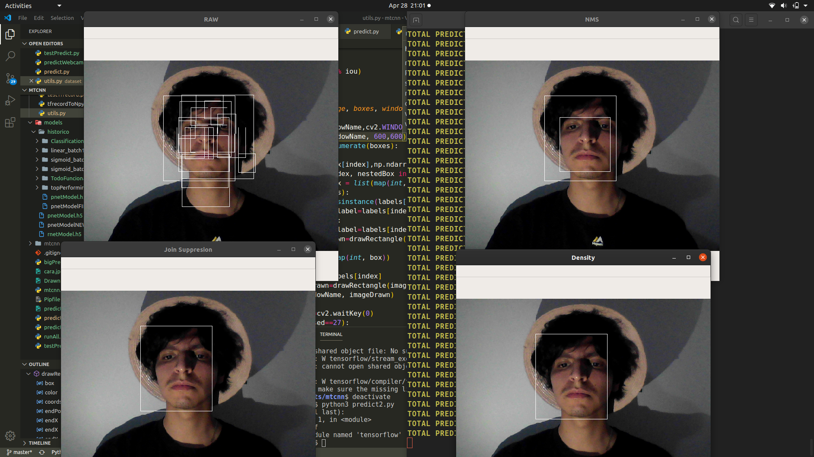
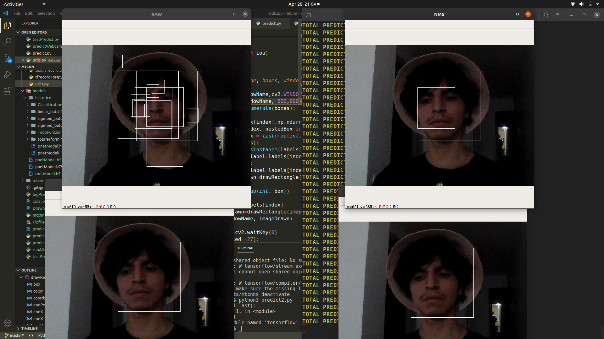

# MTCNN
Modified version of the Multi-task Cascade Neural Network architecture for face recognition and identification.

It uses a P-net and an NMS layer as the original MTCNN proposed, but instead of an R-net and an O-net, it implements 2 filters:

Join supression: joins boxes which overlap to a certain threshold.
Density supression: finds clusters of overlapping boxes and from each cluster picks the most densely overlapped which should be where most predictions in that area are overlapping.

